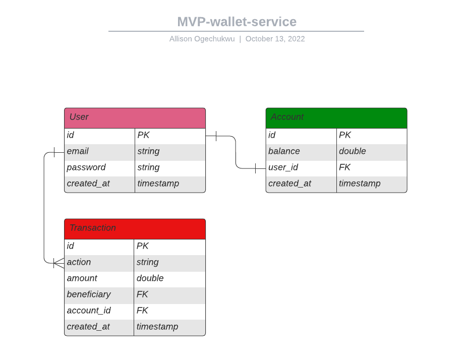

# mvp-wallet-service

## Introduction

A simple REST API with authentication for a wallet service. Tech stack used include:

- [Express.js](https://expressjs.com)
- [Knex.js](https:knexjs.org) (ORM)
- [MySQL](https://mysql.com) DB

### Database Structure

[Check out my LucidChart](https://lucid.app/lucidchart/c2db75ac-0891-4536-b2b1-20e8a0fe15be/edit?view_items=yRKqh-dGCGV0%2CyRKq2mg3OX13%2CyRKqHCDikTjn%2CJ5XZow_X1SGc%2CyRKqP32DqN0h&invitationId=inv_8009efb7-ba86-4b6d-9efc-b65b14d7d517#)

## Overview

The API allows the following tasks:

- Users must authenticate to access all endpoints. Open an account with the `/users` endpoint and login to get bearer access token. Passwords must be strong passwords (at least 8 characters long with a combination of at least an uppercase character, a lowercase character, a digit and a symbol).

- User must open an account to perform all transactions: get summary of transactions, get account details, deposit, withdraw and transfer.

## Authentication

Authentication is done with JWT. See the full documentation at the end of this document for guidiance

## Error Codes

### General

HTTP Exceptions across all endpoints except authentication

- `HTTP_401_UNAUTHORIZED`: Access Denied/Unauthorized request 

- `HTTP_401_UNAUTHORIZED`: User's credentials could not be verified 

- `HTTP_422_UNPROCESSABLE`: "Invalid token"

### Authentication

HTTP Exceptions with `/login` endpoint

- `HTTP_422_UNPROCESSABLE`: Email must be valid

- `HTTP_422_UNPROCESSABLE`: Password must be a string

- `HTTP_401_UNAUTHORIZED`: User's credentials could not be verified 

### Users

HTTP Exceptions with `/users` endpoint

- `HTTP_422_UNPROCESSABLE`: Email must be valid

- `HTTP_422_UNPROCESSABLE`: Password must be at least 8 characters long with a combination of at least an uppercase character, a lowercase character, a digit and a symbol

- `HTTP_409_CONFLICT`: Duplicate entry: user@email.com already exists

### Accounts

HTTP Exceptions with `/accounts` endpoint

- `HTTP_409_CONFLICT`: Duplicate entry: account already exists

- `HTTP_404_NOT_FOUND`: User {id} does not have an account

### Transfers

HTTP Exceptions with `/transfers` endpoint

- `HTTP_403_FORBIDDEN`: Amount is invalid: enter a value greater than 0

- `HTTP_404_NOT_FOUND`: User {id} does not have an account  

- `HTTP_409_CONFLICT`: Insufficient balance

- `HTTP_404_NOT_FOUND`: Account {id} not found

- `HTTP_403_FORBIDDEN`: Restricted request: cannot transfer to self

### Deposits

HTTP Exceptions with `/deposits` endpoint

- `HTTP_403_FORBIDDEN`: Amount is invalid: enter a value greater than 0

- `HTTP_404_NOT_FOUND`: User {id} does not have an account

- `HTTP_409_CONFLICT`: Insufficient balance

### Withdrawals

HTTP Exceptions with `/withdrawals` endpoint

- `HTTP_403_FORBIDDEN`: Amount is invalid: enter a value greater than 0

- `HTTP_404_NOT_FOUND`: User {id} does not have an account

- `HTTP_409_CONFLICT`: Insufficient balance

## Transactions

HTTP Exceptions with `/transactions` endpoint

- `HTTP_404_NOT_FOUND`: User {id} does not have an account

## Endpoints

[See full documentation](https://documenter.getpostman.com/view/12015411/2s83zmMhzh)